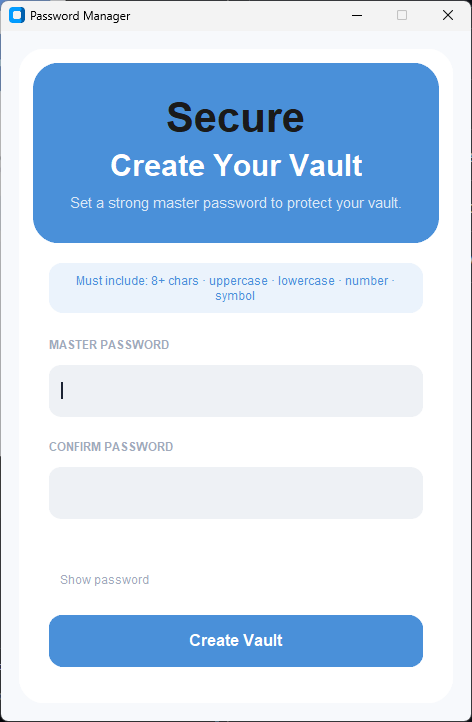
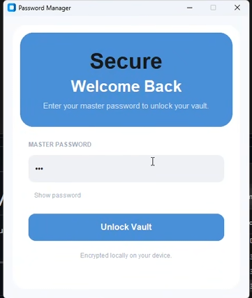
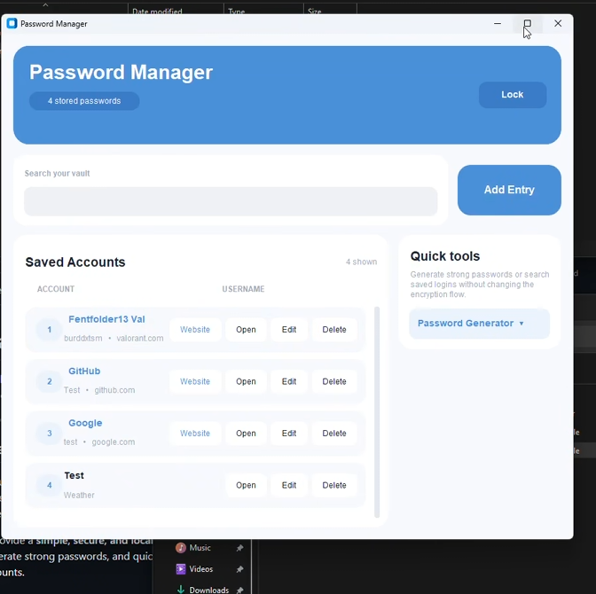
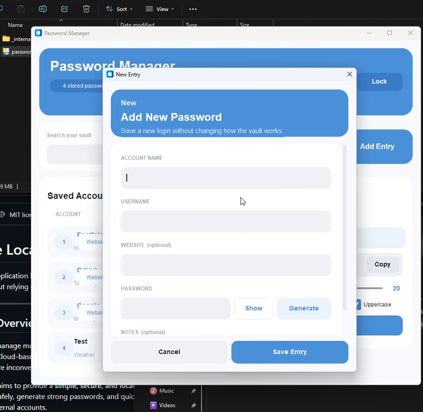
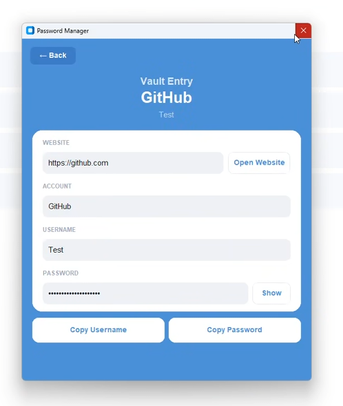
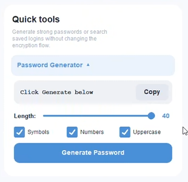

# Secure Local Password Manager

This is a desktop app we built in Python for one of our classes. It lets you store your passwords locally on your computer — no cloud, no account, nothing gets sent anywhere. You just set a master password and it encrypts everything on your machine.

---

## Screenshots

### First time opening it — create your vault


### After that, you just log in with your master password


### Main screen where all your passwords show up


### Adding a new password


### Opening a saved entry to see the details


### There's also a built-in password generator


---

## What You Need Before Starting

- **Python 3.13 or higher** — download it at https://www.python.org/downloads/ *(if you already have Python installed, skip this)*
- **VS Code** — download it at https://code.visualstudio.com/ (this is what we used)

> **Important for Windows:** When you install Python, on the very first screen there's a checkbox that says **"Add python.exe to PATH"** — make sure you check that before hitting install. If you skip it, nothing will work and you'll have to reinstall.

---

## How to Run It

Open a terminal in VS Code (`Ctrl + ~` on Windows or `Ctrl + `` on Mac) and run these commands one at a time:

**1. Clone the repo**

```bash
git clone https://github.com/your-repo/Secure-Password-Manager.git
cd Secure-Password-Manager
```

**2. Set up a virtual environment**

This keeps the dependencies isolated to just this project.

```bash
# Windows
python -m venv venv
venv\Scripts\activate

# Mac
python3.13 -m venv venv
source venv/bin/activate
```

Once it's activated your terminal should show `(venv)` at the start of the line.

**3. Install the dependencies**

```bash
# Windows
python -m pip install customtkinter cryptography

# Mac
pip3 install customtkinter cryptography
```

**4. Run the app**

```bash
# Windows
python src/password_manager.py

# Mac
python3 src/password_manager.py
```

---

## Every Time You Come Back to This Project

You have to activate the virtual environment again each time you open a new terminal — it doesn't stay on automatically.

```bash
# Windows
venv\Scripts\activate
python src/password_manager.py

# Mac
source venv/bin/activate
python3 src/password_manager.py
```

---

## If Something Isn't Working

**"python is not recognized"**
→ Python isn't installed or you forgot to check the PATH box during install. Reinstall it and make sure that box is checked.

**"pip is not recognized"**
→ Use `python -m pip install ...` instead of just `pip install ...`

**The activate command fails on Windows**
→ Run this first and then try again:
```bash
Set-ExecutionPolicy -ExecutionPolicy RemoteSigned -Scope CurrentUser
```

**The app opens but immediately closes**
→ You probably need to install the dependencies. Run:
```bash
python -m pip install customtkinter cryptography
```

---

## How the Security Works

- Passwords are encrypted using **AES-256** through Python's `cryptography` library
- Your master password is never actually saved anywhere — it's used to derive an encryption key
- Everything stays on your computer inside the `data/` folder
- The vault file (`data/vault.enc`) is in `.gitignore` so it never gets pushed to GitHub

---

## Project Structure

```
Secure-Password-Manager/
├── src/
│   ├── master_password_screen.py   # run this to start the app
│   └── password_manager.py         # handles all the logic
├── data/
│   └── vault.enc                   # your encrypted passwords (not on GitHub)
├── doc/
├── test/
├── .gitignore
└── README.md
```